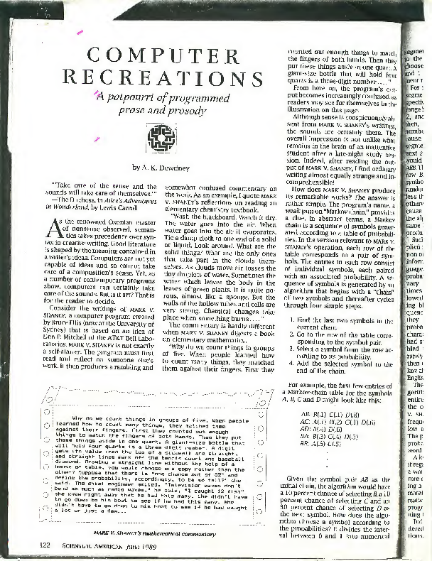

# markov

Codewalk: [Markov chain algorithm](https://go.dev/doc/codewalk/markov/) ([2011](https://github.com/golang/go/commit/2a189845b619ec27772d4b21d2a3cb9e27d5fbb8))

Train a statistical language model (on 1053988 words/tokens) in [less then a
second](https://www.intel.com/content/www/us/en/products/sku/230498/intel-core-i913900t-processor-36m-cache-up-to-5-30-ghz/specifications.html)
and generate text.

```shell
$ zstdcat static/1m.txt.zst | ./markov -words 200 | fold -s -w 80
```

Example output:

> down stairs rahas and his sockets and the priest see that its duller we all
> had rooms apart and their meat and to the voice of the wall and jonathan out
> of a stammering tongue that speaketh unto men to eat and him that speaketh
> like the diamonds and the wall of the lord god made promise to another shall
> have no confidence in princes nor servants for ever and ever great is our
> refuge selah o bless our lord jesus and love one another and him that dieth
> of itself sufficient unto the lord he against whom when aquila and the first
> year of their time in the month adar the copy of the families thereof and
> will render praises unto my master my wife for er his firstborn son of
> berechiah the son of ahikam the son of man whom she adores and who can
> stretch himself on it too closely to allow the deeds of your virtuous
> principles she would tell him to whom the rest of the city as the other sex
> as to serve with rigour and if i hold fast that i am the lord shall deliver
> it into the hand of joab he

[](https://archive.org/details/ComputerRecreationsMarkovChainer)

